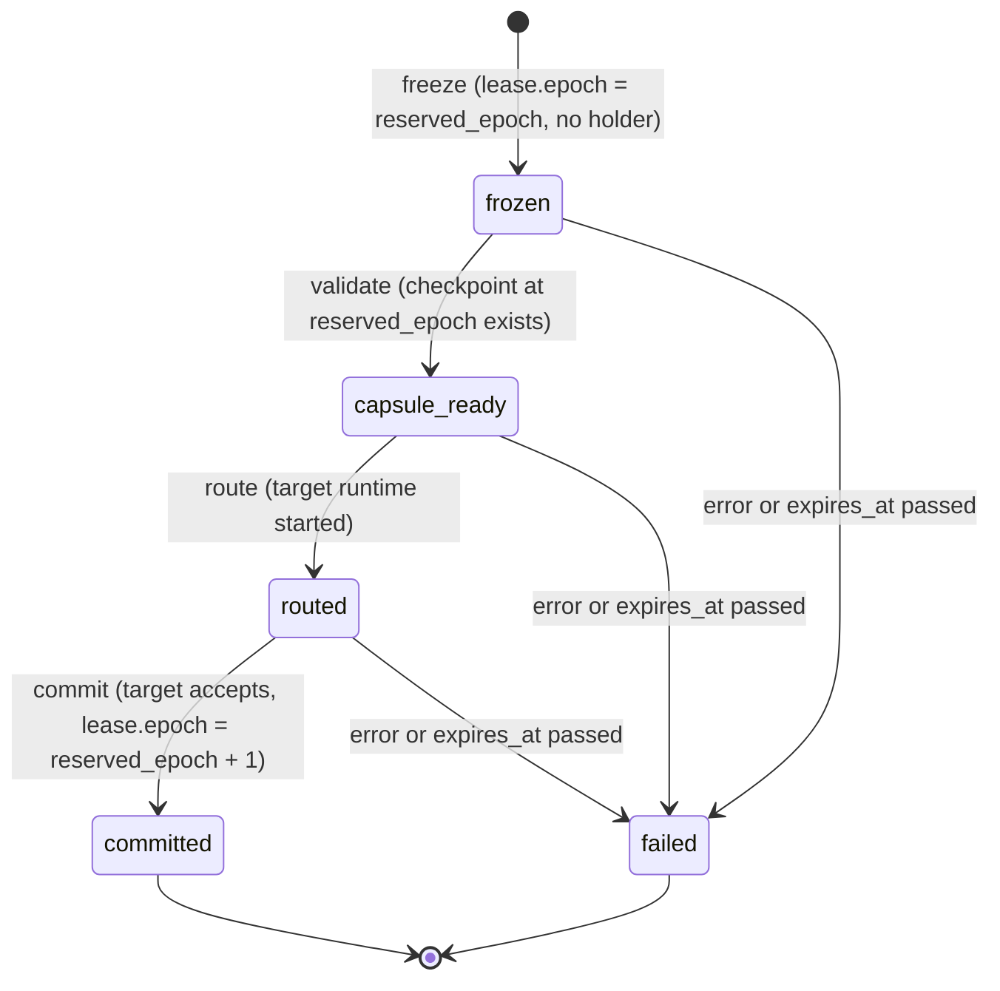

# Personal Agent Account Protocol (PAAP) v0.1

Status: **draft** · protocol identifier: `paap/0.1`

OpenRoly is the reference implementation of the Personal Agent Account Protocol.

PAAP is a file format plus a small set of rules for carrying an agent's **ongoing work** across runtimes and
products: who the agent is, what it is working on, how far it got, and who the work was handed to. Everything
an implementation needs is in this document and the JSON Schemas in [v0.1](v0.1).

## 1. Why

Agents already have protocols for calling tools (MCP), for talking to an editor (ACP), and for finding each
other (A2A). None of them says how a piece of work **continues** when the model, the machine, or the product
changes. That state lives inside each product today, so switching means explaining the task again.

PAAP publishes continuation itself, in a form anyone can implement:

- a **checkpoint** that captures work state, never the conversation;
- a **write lease with an epoch**, so a late command from the previous runtime cannot overwrite the next one;
- a **two-phase handoff** that either commits or fails, and never loses a checkpoint.

v0.1 defines four objects (Identity, Work, Checkpoint, Handoff) and a Manifest. Memory, skills, policies,
receipts, signatures, and a network binding come in later versions (§10).

## 2. Conventions

- MUST, MUST NOT, SHOULD, and MAY are used as described in RFC 2119 and RFC 8174 when they appear in capitals.
- Every file is a UTF-8 JSON object (RFC 8259) within the I-JSON subset (RFC 7493): it does not start with a byte
  order mark, no object repeats a member name, and no string (member names included) holds a lone surrogate.
  Common JSON parsers accept all three silently, so a validator checks them itself.
- An integer field holds a JSON number without a fractional part; `3` and `3.0` are the same integer.
- Timestamps are RFC 3339 in UTC with a `Z` suffix, for example `2026-09-14T09:30:00Z`. Fractional seconds are
  optional. A timestamp names a day that exists in the Gregorian calendar and has no leap second; exactly the strings
  matching this regular expression are timestamps:
  `^(?:[0-9]{4}-(?:(?:0[13578]|1[02])-(?:0[1-9]|[12][0-9]|3[01])|(?:0[469]|11)-(?:0[1-9]|[12][0-9]|30)|02-(?:0[1-9]|1[0-9]|2[0-8]))|(?:[0-9]{2}(?:0[48]|[2468][048]|[13579][26])|(?:[02468][048]|[13579][26])00)-02-29)T(?:[01][0-9]|2[0-3]):[0-5][0-9]:[0-5][0-9](?:\.[0-9]{1,9})?Z$`.
  Timestamps are compared as instants down to the last fractional digit (`…:00.0002Z` is later than `…:00.0001Z`),
  not as strings.
- Optional fields are **omitted** when absent; `null` is not a value in PAAP documents.
- Every string field is non-empty.
- Identifiers (`account_id`, `work_id`, …) are opaque strings. Writers SHOULD use a type prefix and a
  time-ordered id (for example `wrk_` followed by a UUIDv7 in hex); readers MUST NOT parse them.
- Hashes are lowercase hex SHA-256. Public keys are JWKs (RFC 7517).
- "Sorted" means ordered by UTF-16 code units, the order JCS (RFC 8785) uses.

## 3. Capsule directory

A capsule is a directory, conventionally named `<name>.capsule/`:

```
<name>.capsule/
  manifest.json
  identity.json
  works/<work_id>/work.json
  works/<work_id>/checkpoints/<version>.json
  works/<work_id>/handoffs/<handoff_id>.json
```

- Paths use `/`. `<version>` is the decimal version without leading zeros.
- Files and directories whose name starts with `.` are not part of the capsule and are ignored.
- Every other file MUST be listed in `manifest.json` (**I-11**). Readers ignore listed paths they do not
  understand; later versions add files (for example `memory/`) this way.
- A capsule MAY travel as a tar or zip archive of this directory. The layout inside is the same.

## 4. Objects

### 4.1 Manifest

Schema `urn:paap:v0.1:manifest` — [manifest.schema.json](v0.1/manifest.schema.json)

| Field | Type | Required | Meaning |
|---|---|---|---|
| `protocol` | `"paap/0.1"` | yes | The version of this capsule |
| `exported_at` | timestamp | yes | |
| `exporter` | `{ name, version }` | yes | The implementation that wrote the capsule |
| `contents` | `[{ path, sha256 }]` | yes | Every file except `manifest.json` (**I-11**) |
| `reenter` | `{ credential_refs, devices }` | yes | What a person must set up again after import: the environment variable names that checkpoints reference, and how many devices are not revoked. Names and counts only, never values |
| `ext` | object | no | Extensions (§10) |

### 4.2 Identity

Schema `urn:paap:v0.1:identity` — [identity.schema.json](v0.1/identity.schema.json)

| Field | Type | Required | Meaning |
|---|---|---|---|
| `protocol` | `"paap/0.1"` | yes | |
| `account_id` | string | yes | The account that owns everything in the capsule |
| `agent_id` | string | yes | The account's agent identity |
| `display_name` | string | yes | |
| `owner` | `<kind>:<id>` | no | Who owns the account, for example an organization that runs the agent. Reserved in v0.1: readers need not act on it |
| `handles` | `[{ handle, status, authority? }]` | yes | `status` is `current` or `alias`, with at most one `current`. `handle` is stored without `@`. `authority` names who issued the handle, for example a domain |
| `keys` | `{ account?: { key_id, jwk }, devices: [{ id, name, jwk, revoked_at? }] }` | yes | Public keys of the account and of its devices (`devices` may be empty) |
| `exported_at` | timestamp | yes | |
| `ext` | object | no | Extensions (§10) |

The keys are the identity; a handle is a name that points at it. v0.1 does not define how handles are resolved.

### 4.3 Work

Schema `urn:paap:v0.1:work` — [work.schema.json](v0.1/work.schema.json)

| Field | Type | Required | Meaning |
|---|---|---|---|
| `id` | string | yes | |
| `owner` | `<kind>:<id>` | yes | For example `account:acc_…` |
| `title` | string | yes | |
| `goal` | string | no | A one-line goal; the checkpoint body carries the full one |
| `status` | enum | yes | `triage` `backlog` `todo` `scheduled` `ready` `running` `review` `blocked` `done` `needs_user` |
| `visibility` | enum | yes | `full` `masked` `local_only` `none`: how much of this work may leave the owner's devices |
| `lease` | `{ epoch, holder_run?, acquired_at?, expires_at? }` | yes | The single write lease. `epoch` starts at 0 and only increases; `holder_run` is the run allowed to write now |
| `profile` | enum | yes | `full` or `reviewer_blind` (**I-8**) |
| `parent_work_id` | string | no | The project this work is a task of |
| `forked_from` | `{ work_id, checkpoint_version }` | no | The checkpoint this work branched from |
| `created_at`, `updated_at` | timestamp | yes | |
| `ext` | object | no | Extensions (§10) |

### 4.4 Checkpoint

Schema `urn:paap:v0.1:checkpoint` — [checkpoint.schema.json](v0.1/checkpoint.schema.json)

| Field | Type | Required | Meaning |
|---|---|---|---|
| `work_id` | string | yes | |
| `version` | integer ≥ 1 | yes | **I-1** |
| `write_epoch` | integer ≥ 0 | yes | The lease epoch the writer held |
| `run_id` | string | no | The run that wrote it |
| `content_hash` | SHA-256 hex | yes | **I-3** |
| `based_on` | `{ work_id?, version }` | no | The checkpoint this one was derived from (**I-12**). Without `work_id`, an earlier version of the same work: a **rollback**. With `work_id`, a version of another work: a **fork** or **clone**. Branches of work are this one field over immutable versions |
| `body` | object | yes | The fields below. All are optional and hold any JSON value |
| `created_at` | timestamp | yes | |
| `ext` | object | no | Extensions (§10) |

| Body field | Meaning |
|---|---|
| `goal` | What done looks like |
| `current_state` | Where the work stands now |
| `decisions` | Decisions already made, so they are not reopened |
| `unresolved_questions` | Questions still open |
| `failed_attempts` | What was tried and why it did not work, so the next runtime does not repeat it |
| `relevant_artifacts` | Files, URLs, and outputs that matter |
| `relevant_memory` | Long-term facts the next runtime needs |
| `git_state` | Repository state. The reference implementation writes `{ baseCommit, dirty, trackedPatch?, stagedPatch?, untrackedFiles?, hashes?, omitted? }`; v0.1 does not constrain it |
| `capability_requirements` | What the work needs, named `<domain>.<verb>` (for example `github.pr.create`). Secrets appear only as `credential_ref` (**I-4**) |

### 4.5 Handoff

Schema `urn:paap:v0.1:handoff` — [handoff.schema.json](v0.1/handoff.schema.json)

| Field | Type | Required | Meaning |
|---|---|---|---|
| `id` | string | yes | |
| `work_id` | string | yes | |
| `from_run` | string | no | The run that held the lease when the handoff started |
| `from_epoch` | integer | yes | The lease epoch when the handoff started |
| `reserved_epoch` | integer | yes | `from_epoch + 1`: the lease epoch while the handoff is in progress (**I-5**) |
| `to_runtime` | string | yes | The kind of runtime that continues, for example `claude` or `codex` |
| `source_state` | `held` or `lapsed` | no | Whether the source lease was still alive when the handoff started (`lapsed`: its session had already died). Absent means `held` |
| `checkpoint_version` | integer ≥ 1 | no | The checkpoint the target starts from, written at `reserved_epoch` |
| `state` | enum | yes | `frozen` `capsule_ready` `routed` `committed` `failed` (§6) |
| `reason` | string | no | Why it failed, for example `route_timeout` or `commit_timeout` |
| `note` | string | no | A note from whoever started the handoff |
| `expires_at` | timestamp | yes | A handoff still in progress at this time fails |
| `created_at`, `updated_at` | timestamp | yes | |
| `ext` | object | no | Extensions (§10) |

## 5. Invariants

- **I-1** A checkpoint is immutable. Within a work, versions are unique and consecutive from 1, and
  `works/<work_id>/checkpoints/<version>.json` holds exactly that work and version.
- **I-2** A checkpoint body has no key named `conversation`, `messages`, or `transcript`, at any depth. PAAP
  moves work state, not chat history.
- **I-3** `content_hash` is the SHA-256 of the JSON Canonicalization Scheme (RFC 8785) serialization of `body`.
  The body MUST be I-JSON (in particular, no lone surrogates) so that every implementation computes the same hash.
- **I-4** Secrets are never values. A `credential_ref` key, at any depth, holds `env:NAME` or `env:NAME,NAME,…`,
  where each NAME matches `[A-Za-z_][A-Za-z0-9_]*`.
- **I-5** `reserved_epoch = from_epoch + 1`. While a handoff is in progress, the work's `lease.epoch` is at least
  `reserved_epoch`; once it is `committed`, at least `reserved_epoch + 1`.
- **I-6** A work has at most one handoff in progress (`frozen`, `capsule_ready`, or `routed`).
- **I-7** A failed handoff loses nothing: the checkpoint a handoff names in `checkpoint_version` exists in the
  capsule, whatever the handoff's state.
- **I-8** A checkpoint of a work whose `profile` is `reviewer_blind` holds only `goal`, `relevant_artifacts`,
  `git_state`, and `capability_requirements`. A reviewer sees the goal and the facts, not the previous agent's
  opinions or progress.
- **I-9** Keys are public. A JWK has none of the private members `d`, `p`, `q`, `dp`, `dq`, `qi`, `oth`, `k`,
  and nothing listed in §11 is exported.
- **I-10** A key that the schema does not define is rejected, at every level of a PAAP document
  (`additionalProperties: false`). Checkpoint body values and JWK members are open. Extensions go in `ext` (§10).
- **I-11** `manifest.contents` lists every file of the capsule except `manifest.json`, each once, with the
  SHA-256 of its bytes. `reenter.credential_refs` is the sorted set of NAMEs from every checkpoint's
  `credential_ref` values, and `reenter.devices` is the number of devices without `revoked_at`.
- **I-12** `based_on` names a checkpoint that existed when this one was written: a version of the same work lower
  than this checkpoint's `version`, whether or not `work_id` names the same work; or a version of another work
  present in the capsule.

## 6. Handoff state machine



1. **freeze**: the lease moves to the handoff itself. `lease.epoch` becomes `reserved_epoch` and no run holds it,
   so the source can no longer write and no third run can claim the work.
2. **validate**: the handoff's own checkpoint, written with `write_epoch = reserved_epoch`, exists; the handoff
   becomes `capsule_ready`.
3. **route**: the target runtime was started; the handoff becomes `routed`.
4. **commit**: a runtime of kind `to_runtime` accepts. `lease.epoch` becomes `reserved_epoch + 1` and that
   runtime's run becomes the holder; the handoff becomes `committed`. Commands that carry an older epoch are
   rejected from then on.

`committed` and `failed` are final. Checkpoints stay whatever the outcome (**I-7**).

While a handoff is in progress, the only checkpoint written for the work is the handoff's own
(`write_epoch = reserved_epoch`). A writer MUST NOT add any other checkpoint to that work until the handoff is
`committed` or `failed`: nobody holds the lease in that window.

## 7. Brief

When an implementation shows a checkpoint to a model, it renders the body as Markdown sections in this order:

1. `goal`
2. `current_state`
3. `decisions`
4. `unresolved_questions`
5. `failed_attempts`
6. `relevant_artifacts`
7. `relevant_memory`
8. `git_state`
9. `capability_requirements`

- Each present field becomes `## <field>`, a newline, and the value: a string as it is, any other value as JSON
  indented by 2 spaces.
- Sections are separated by one empty line. Absent fields are skipped.
- Lines of its own (for example what changed in the working tree) MAY come before the first section.
- To fit a size budget an implementation MAY leave out whole sections. It MUST NOT reorder sections or cut one short.

The same checkpoint therefore reads the same to every model, in every implementation.

## 8. Conformance

| Level | An implementation may claim it when it | Tested with |
|---|---|---|
| **L1 Reader** | reads a capsule and reports the summary of §8.1 | every `valid/*` case: the summary equals `expect.summary.json` |
| **L2 Writer** | writes checkpoints that satisfy **I-1** to **I-4**, **I-8**, and **I-12**, keeps the manifest true (**I-11**), writes nothing to a work whose handoff is in progress (§6), and rejects the `invalid/*` cases | `valid/*` pass; each `invalid/*` case fails with the `reason` in its `expect.json` |
| **L3 Continuer** | accepts a `routed` handoff and continues: the handoff becomes `committed` (only `state` and `updated_at` change), `lease.epoch` becomes `reserved_epoch + 1` with its run as the holder, and it writes checkpoint `version + 1` with that `write_epoch`, keeping every earlier checkpoint | start from `valid/handoff-routed`; the result is a valid capsule |

The fixtures are in [v0.1/fixtures](v0.1/fixtures). A valid case is `valid/<case>/capsule/` with
`valid/<case>/expect.summary.json`; an invalid case is `invalid/<case>/capsule/` with
`invalid/<case>/expect.json` (`{ "reason", "path" }`, where `path` is the file at fault). Each invalid case has
exactly one fault. A validator reports one reason. For a capsule with several faults, validators MUST agree that it
is invalid but the order in which faults are checked, and so which reason is reported, is not specified (for
example, `identity.json` listed in the manifest but absent may be `missing_file` or `manifest_contents_mismatch`).

### 8.1 L1 summary

The summary is a conformance output, not a PAAP document, so it uses `null` for "none".

| Field | Value |
|---|---|
| `protocol` | `manifest.protocol` |
| `handle` | `@` followed by the `current` handle, or `null` |
| `display_name` | `identity.display_name` |
| `current_work` | `{ id, title, status }` of the work with the latest `updated_at` among works whose `status` is not `done` (ties: the sorted-first `id`), or `null` |
| `latest_checkpoint` | `{ version, write_epoch, content_hash, brief_sections }` of the current work's highest version, or `null`. `brief_sections` lists the body fields present, in §7 order |
| `last_handoff` | `{ id, state, to_runtime, reserved_epoch }` of the current work's handoff with the latest `created_at` (ties: the sorted-first `id`), or `null` |
| `reenter` | `manifest.reenter` |

### 8.2 Implementations

| Implementation | Language | Levels | Checked by |
|---|---|---|---|
| OpenRoly (`packages/core/src/protocol.ts`, `openroly export`, `openroly capsule verify`) | TypeScript | L3 | Every push: the fixtures, and a capsule exported from a live account server, continued across a `routed` handoff |
| MiniRoly (`examples/miniroly`) | TypeScript, no dependencies | L1, L2 | Every push: the fixtures; the checkpoints it writes are checked by the OpenRoly validator |
| MiniRoly-py (`examples/miniroly-py`) | Python, standard library only | L1 | Every push: the fixtures |

Both examples were written from this document and the schemas only. On every push, both read the capsule
OpenRoly exported after continuing a handoff and report the same summary as OpenRoly.

## 9. Failure reasons

| Reason | Rule | Meaning |
|---|---|---|
| `missing_file` | §3 | `manifest.json`, `identity.json`, or a `works/<work_id>/work.json` is absent |
| `invalid_json` | §2 | A file is not UTF-8 JSON, starts with a byte order mark, or repeats a member name in an object |
| `unsupported_protocol` | §10 | `protocol` is not `paap/0.1` |
| `unknown_key` | I-10 | A key the schema does not define |
| `missing_field` | §4 | A required field is absent |
| `invalid_field` | §4 | A field has the wrong type, format, or value (including an `ext` key that is not `<vendor>.<key>`), or more than one handle is `current` |
| `manifest_contents_mismatch` | I-11 | A file is not listed, a listed file is absent, or a path is listed twice |
| `manifest_hash_mismatch` | I-11 | A listed `sha256` differs from the file's bytes |
| `reenter_mismatch` | I-11 | `reenter` disagrees with the checkpoints or the devices |
| `private_key_in_export` | I-9 | A JWK has a private member |
| `path_mismatch` | I-1 | A file's location disagrees with its `id`, `work_id`, or `version` |
| `conversation_in_checkpoint` | I-2 | A body has `conversation`, `messages`, or `transcript` |
| `invalid_credential_ref` | I-4 | A `credential_ref` is not `env:NAME[,NAME…]` |
| `not_i_json` | §2, I-3 | A file has a lone surrogate |
| `content_hash_mismatch` | I-3 | `content_hash` is not the hash of the body |
| `profile_field_not_allowed` | I-8 | A `reviewer_blind` work's checkpoint has a field outside its list |
| `version_gap` | I-1 | A work's versions are not 1, 2, 3, … |
| `based_on_missing` | I-12 | `based_on` names a checkpoint that is not in the capsule, or a same-work version that is not earlier |
| `epoch_not_reserved` | I-5 | `reserved_epoch` is not `from_epoch + 1` |
| `handoff_in_progress_twice` | I-6 | A work has two handoffs in progress |
| `handoff_checkpoint_missing` | I-7 | `checkpoint_version` names a checkpoint that is not in the capsule |
| `lease_behind_handoff` | I-5 | The work's `lease.epoch` is below what a handoff requires: `reserved_epoch` while it is in progress, `reserved_epoch + 1` once it is `committed` |

## 10. Versioning and extensions

- `protocol` is `paap/<major>.<minor>`. A minor version only **adds** files and optional fields. A major version
  may change requirements; there is none before 1.0.
- A validator checks the exact version it implements and reports `unsupported_protocol` for any other. A reader
  MAY read a newer minor version, ignoring files and fields it does not know.
- `ext` is allowed on every object. Its keys are `<vendor>.<key>` (pattern `^[a-z0-9-]+\.[A-Za-z0-9_.-]+$`, for
  example `acme.review.round`), and readers ignore keys they do not understand; a key that does not match the pattern is `invalid_field`. Vendor data goes here, never
  in new top-level keys.
- Later versions are planned to add memory records, skills, policies and receipts, signatures, a network binding
  for handoff, and delegation. None of them is part of v0.1.

## 11. Not exported

| Never in a capsule | Instead |
|---|---|
| Private keys, including wrapped key material | Public JWKs only (**I-9**) |
| OAuth access and refresh tokens | Authorize again after import |
| Passwords and recovery codes | Nothing; the person keeps them |
| Secret values such as API keys | `credential_ref: "env:NAME"`; the names are counted in `manifest.reenter` |
| Conversation transcripts | Checkpoint fields (**I-2**) |

## 12. Relation to other specifications

- Keys use JWK (RFC 7517), the hash input uses JCS (RFC 8785), time uses RFC 3339, and the schemas use JSON
  Schema 2020-12.
- PAAP does not define tool calls (MCP), editor-to-agent control (ACP), or agent discovery (A2A); an
  implementation uses them alongside PAAP.
- An agent definition in another format (for example Letta's Agent File) MAY travel in the capsule under
  `interoperability/`, listed in the manifest. v0.1 readers ignore it.
- In the OpenRoly repository, the validator for this version is `packages/core/src/protocol.ts` and the
  conformance test is `packages/core/test/protocol.test.ts`.

## Appendix A. MCP profile (informative)

This appendix is **informative**: it is not part of conformance, and a PAAP implementation does not need MCP.
It shows how the MCP tools of the reference implementation map onto the four objects, so that any harness that
speaks MCP can leave work with a PAAP implementation the same way. A later version turns this into a normative
binding.

| MCP tool | PAAP object | What it does in PAAP terms |
|---|---|---|
| `work_current` | Work | Reads the work whose lease has a live run right now (the live counterpart of the L1 `current_work`) |
| `work_get` | Work | Reads one work: `status`, `lease`, `owner` |
| `work_capsule` | Checkpoint | Writes the next checkpoint version from body fields. Only the lease holder may write; conversation keys are refused (**I-2**) and secrets go in as `credential_ref` (**I-4**) |
| `work_capsules` | Checkpoint | Lists a work's checkpoints, oldest first |
| `work_transfer` | Handoff | Starts a handoff: freezes the lease, writes the checkpoint at `reserved_epoch`, and routes to `to_runtime` |
| `work_accept` | Handoff, Checkpoint | Commits a `routed` handoff (or takes a forked work) and returns the brief of §7 |
| `work_fork` | Work, Checkpoint | Creates a work with `forked_from` and a `profile` (`full` or `reviewer_blind`); its first checkpoint is `based_on` the source version (**I-12**) |
| `work_freeze` | Work | Releases the lease and advances `lease.epoch`, so commands with the previous epoch are rejected |
| `work_handoff` | Work | Leaves a note and facts for whoever picks the work up next. It does not move the lease, so it is not a PAAP Handoff |
| `work_events` | none in v0.1 | The work's event log; later versions carry this as receipts |
| `work_proof` | none in v0.1 | Records what a check reported; later versions carry this as receipts |

## Appendix B. Continuity Benchmark (informative)

[benchmark.md](benchmark.md) fixes what a continuity benchmark measures across a handoff: when the next runtime
took its first useful action, whether a person had to explain the work again, and which checkpoint fields did not
reach it. It is not part of conformance.
